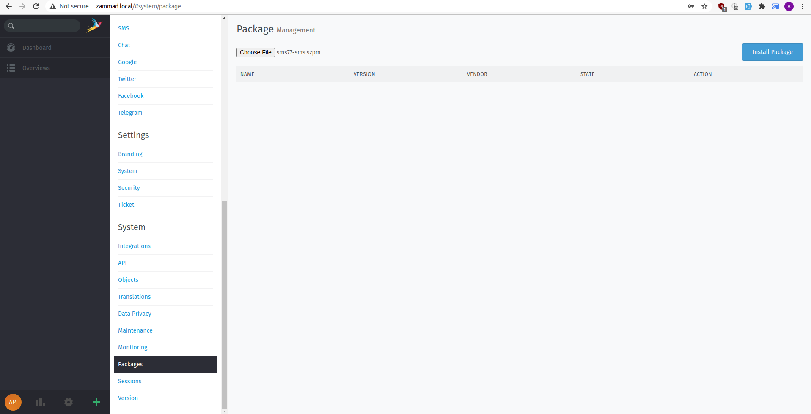
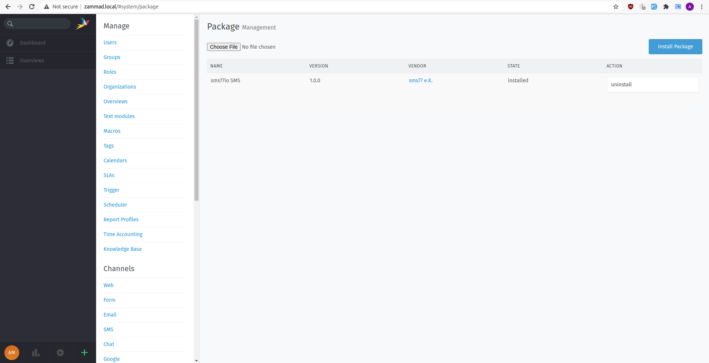
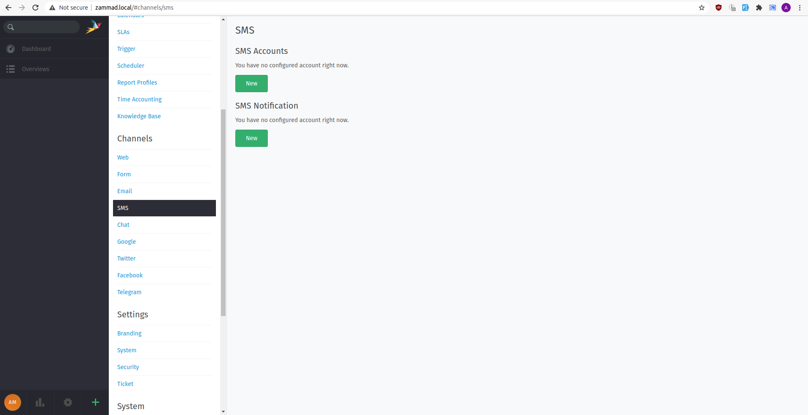
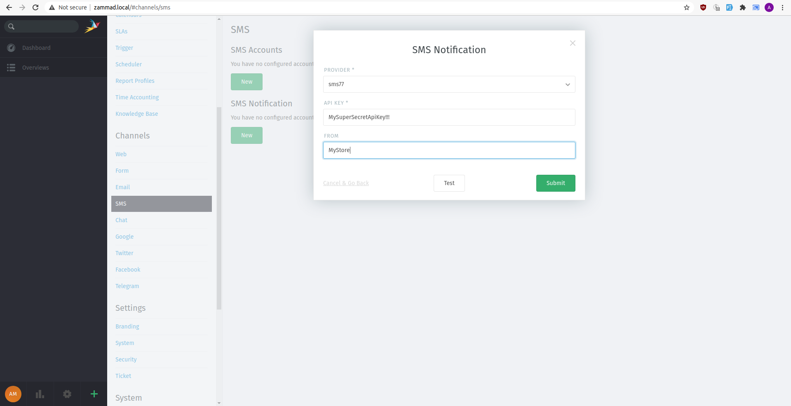
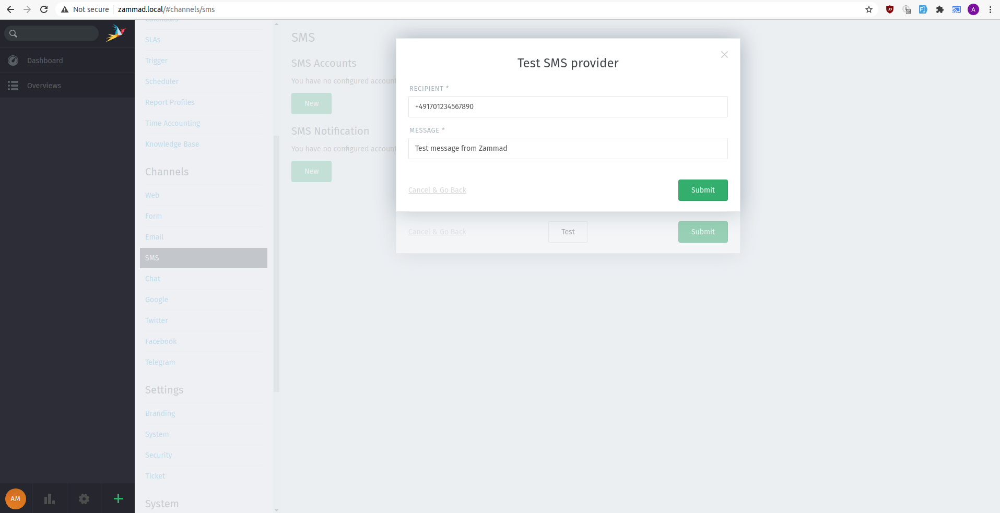
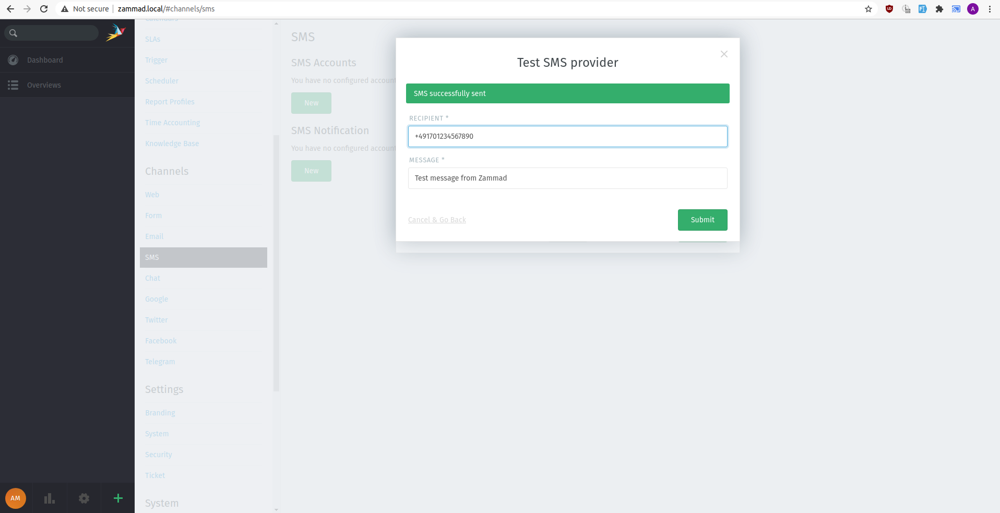
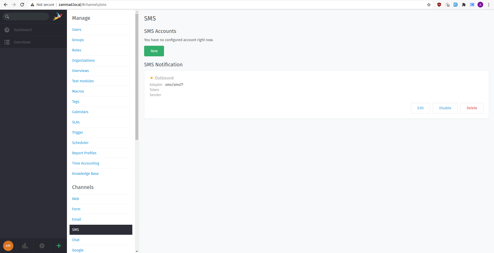

<p align="center">
  
</p>

<h1 align="center">seven SMS for Zammad</h1>

<p align="center">
  Two-way SMS messaging for Zammad via the seven gateway.
</p>

<p align="center">
  <a href="LICENSE"></a>
  
  
</p>

---

## Features

- **Outbound SMS** &mdash; Send SMS notifications directly from Zammad tickets
- **Inbound SMS** &mdash; Receive SMS and automatically create or update tickets
- **Custom Sender ID** &mdash; Configure a sender name or number for outbound messages

## How it works

```
                    ┌────────────────┐
                    │  Zammad Ticket │
                    └───────┬────────┘
                            │
            ┌───────────────┼───────────────┐
            │               │               │
            ▼               ▼               ▼
    ┌──────────────┐ ┌──────────────┐ ┌──────────────┐
    │   Outbound   │ │   Inbound    │ │ Notification │
    │   (Reply)    │ │  (Webhook)   │ │  (Trigger)   │
    └──────┬───────┘ └──────┬───────┘ └──────┬───────┘
           │                │                │
           └────────────────┼────────────────┘
                            │
                            ▼
              ┌───────────────────────┐
              │  seven SMS Gateway    │
              │  gateway.seven.io     │
              └───────────┬───────────┘
                          │
                          ▼
                   ┌──────────────┐
                   │   Customer   │
                   │    Phone     │
                   └──────────────┘
```

## Prerequisites

- Zammad v6.x (self-hosted)
- A [seven account](https://www.seven.io/) with API key ([How to get your API key](https://help.seven.io/en/api-key-access))

## Installation

### Step 1: Upload the package

Download **seven-sms.szpm** from the [latest release](https://github.com/seven-io/zammad/releases/latest).

In Zammad, navigate to **Admin > System > Packages**, click **Choose File** and select the downloaded `.szpm` file, then click **Install Package**.

<details>
<summary>Screenshot: Package Management</summary>
<br>

</details>

<details>
<summary>Screenshot: Package installed</summary>
<br>

</details>

### Step 2: Finalize installation

> **Important:** This step is required! Without it, the plugin will not appear in the SMS provider selection.

Run these commands on your Zammad server as the *zammad* user:

```bash
zammad run rake zammad:package:migrate
zammad run rake assets:precompile
systemctl restart zammad
```

### Step 3: Configure SMS Notification

Navigate to **Channels > SMS** and click **New** under *SMS Notification*. Select **seven** as the provider, enter your API key and optionally set a sender ID.

<details>
<summary>Screenshot: SMS Channel overview</summary>
<br>

</details>

<details>
<summary>Screenshot: Configure SMS Notification</summary>
<br>

</details>

### Step 4: Test

Click **Test** to verify the connection. You should see a "SMS successfully sent" confirmation.

<details>
<summary>Screenshot: Test SMS provider</summary>
<br>

</details>

<details>
<summary>Screenshot: Success</summary>
<br>

</details>

<details>
<summary>Screenshot: Final result</summary>
<br>

</details>

## Inbound SMS (Webhook)

To receive incoming SMS as Zammad tickets:

1. Set up a [webhook at seven](https://help.seven.io/en/articles/9582203-how-do-i-receive-sms) &mdash; make sure the format is set to **JSON**
2. Point the webhook URL to your Zammad instance
3. Incoming SMS will automatically create new tickets or append to existing conversations

## Usage

For general SMS usage in Zammad, refer to the official [Zammad SMS documentation](https://admin-docs.zammad.org/en/6.1/channels/sms.html).

## Troubleshooting

| Problem | Solution |
|---|---|
| Plugin not visible after install | Run the post-install commands from Step 2 and restart Zammad |
| SMS sending fails | Check your API key in the seven [dashboard](https://app.seven.io/) and verify your account balance |
| Inbound SMS not creating tickets | Ensure the webhook at seven is set to type **JSON** and the URL is reachable |

## Support

Need help? Feel free to [contact us](https://www.seven.io/en/company/contact/).
